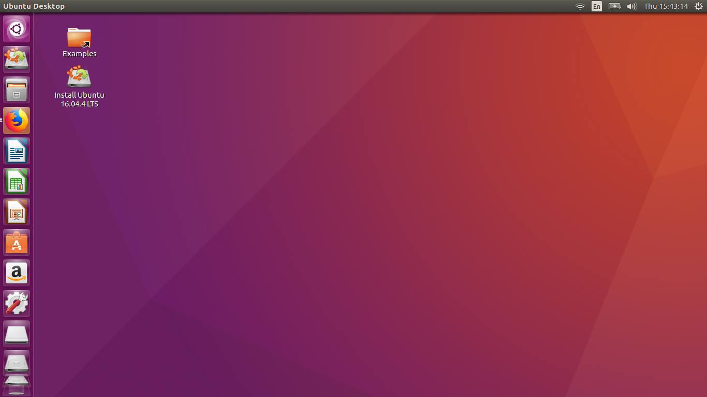
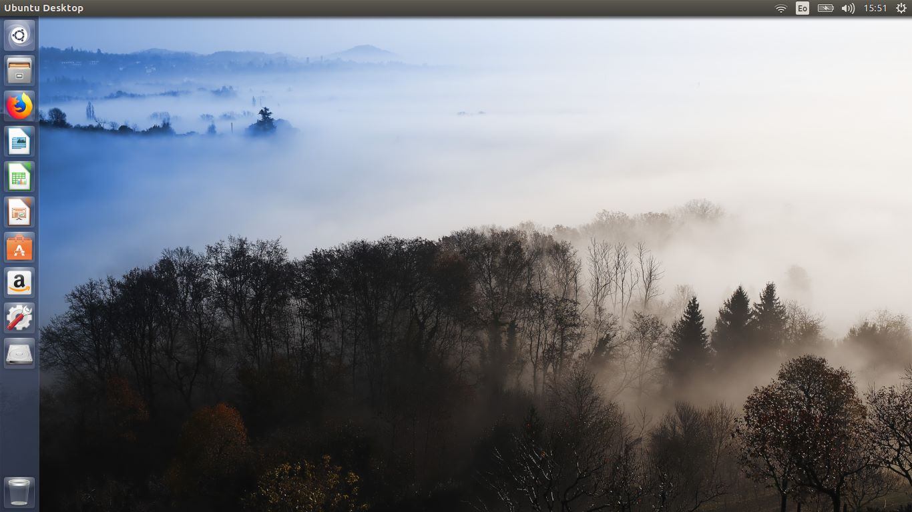
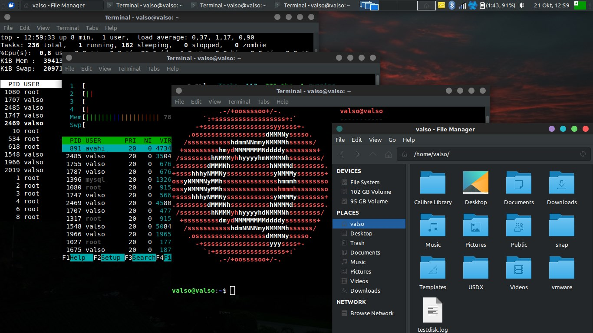

<link rel="stylesheet" href="https://cdn.simplecss.org/simple.min.css">

[[หน้าหลัก]](index.md)

# รู้จักลินุกซ์ได้อย่างไร

ลินุกซ์อธิบายง่าย ๆ คือระบบปฏิบัติการหนึ่งนอกจาก Windows, MacOS ที่คนทั่ว ๆ ไปรู้จัก

กระผมไปรู้จักระบบปฏิบัติการนี้ได้อย่างไร ความจริงตัวกระผมเองก็ไม่ได้อยู่ในวงการ IT หรือ programmer แต่อย่างไร

จริง ๆ กระผมก็จำไม่ได้หรอก แต่...

ผมน่าจะรู้จักระบบปฏิบัติการนี้จากชุมชนผู้ใช้ภาษาเอสเปรันโต เนื่องจากมีการพูดถึงการเพิ่มภาษานี้เข้าไปในโปรแกรมต่าง ๆ ในลินุกซ์

จากนั้นประมาณ 2018 (2561) คอมพิวเตอร์ผมถูกไวรัสโจมตี จนไฟล์เอกสารต่าง ๆ เสียหาย และมีความรู้สึกว่าระบบปฏิบัติการเดิมที่ใช้ไม่มีความปลอดภัยจากไวรัส (ณ ขณะนั้น) จึงเริ่มทดลองติดตั้งลินุกซ์ และดิสโทรแรกที่ทดลองคือ Ubuntu และต่อมาใช้ Xubuntu บนโน้ตบุ๊คที่ใช้ทำงานประมาณ 3 ปี จนซื้อคอมเครื่องใหม่

ปัจจุบันยังมีการใช้งานอยู่เป็นระยะ ๆ ลองเล่นดิสโทรตัวอื่น ๆ ลงบน VM บ้าง ลงในโน้ตบุ๊คมือสองบ้าง เรียนรู้วิธีการใช้งานการตั้งค่าต่าง ๆ และร่วมในการแปลในโครงการของ [Xfce ภาษาไทย](./traduko_xfce_th.md) [Xfce ภาษาเอสเปรันโต](./traduko_xfce.md) = ยังไม่เสร็จ

## ข้อสังเกตของผมที่ใช้ลินุกซ์
1. เอาไว้ติดตั้งกับคอมรุ่นเก่า
2. ระบบปฏิบัติงานลื่น หากค้าง สามารถปิดไปทันที ใช้ง่าย โดยเฉพาะ Xfce
3. ฟรีและถูกกฎหมาย
4. สามารถแก้ไขปรับแต่งได้ตามความต้องการ ให้ความอิสระสูง
5. ไม่เป็นที่ต้องการของไวรัส
6. แต่อย่างไรก็ตามมีข้อจำกัดบางอย่างที่อาจจะไม่เหมาะกับผู้ใช้ทั่วไป

## ตอนนี้ผมใช้อะไรอยู่
Distro: Bodhi Linux (เพราะไฟล์ขนาดเล็ก ติดตั้งง่าย)

GUI: Xfce (มันลื่น ไม่ค้าง มีโปรแกรมพาแนลและปลั๊กอินครบตามความต้องการ (ชอบ Time-out มาก))

WM: JWM ชอบ แต่ไม่ได้ใช้ประจำ

Coding: Vscodium

Terminal: xfce-terminal

[2025-08-15]
[2025-12-13]
