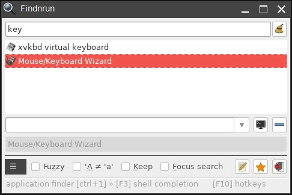
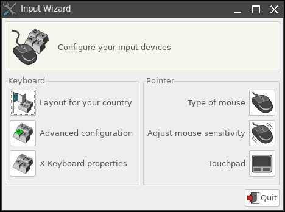
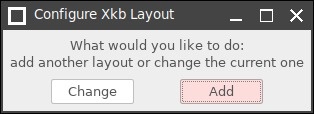
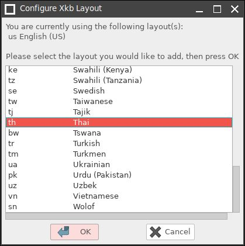

# manual-linux-th
The basic manual for thai linux's users. 

คู่มือการใช้ระบบปฏิบัติการประเภท linux ฉบับคนใช้งานทั่วไป ด้วยภาษาไทย

ไม่อยากให้ภาษามาเป็นกำแพงกั้นความรู้

# ยินดีต้อนรับเข้าสู่ **คู่มือการใช้ระบบปฏิบัติการลินุกซ์ฉบับคนทั่วไป**

เราจะรวบรวมสิ่งปัญหาที่ผู้ใช้ระบบปฏิบัติการตระกูล Linux ของคนทั่วไปที่หันมาใช้ระบบปฏิบัตการนี้ในการทำงานทั่วไป

สารบัญ

# ลินุกซ์แจกจ่ายจาก Ubuntu

* การติดตั้งระบบปฏิบัติการลินุกซ์แจกจ่าย **[Xubuntu](https://xubuntu.org/)**
  * การติดตั้ง Linux ที่สามารถบูตได้ทางแฟรชไดรฟ์ผ่านทาง Terminal
    * `df` หาที่อยู่ของแฟรชไดรฟ์
    * ยกเลิกการเชื่อมต่อของแฟรชไดรฟ์ `sudo umount /ที่/อยู่`
    * ติดตั้งผ่านคำสั่ง `sudo dd bs=4M if=/ที่อยู่/ของ/ไฟล์ISO of=/ที่อยู่ของ/แฟรชไดรฟ์ status=progress oflag=sync` เสร็จ! [ที่มา](https://vitux.com/how-to-create-a-bootable-usb-stick-from-the-ubuntu-terminal/)
  * การตั้งค่าแบบแบ่งพาร์ติชันเอง 
  * โฟลเดอร์ในไดร์ฟไม่สามารถลบ เปลี่ยนชื่อ ย้าย > เนื่องมาจาก dual boot ปิด Windows ไม่สมบูรณ์

* ติดตั้งโปรแกรม
  * LibreOffice ด้วยไฟล์ `.deb` _ซึ่งมีหลายไฟล์มาก_
    * ไปที่ไดเรกทอรี่ที่มีไฟล์ `.deb` แล้ว `~$ sudo dpkg -i *.deb`

  * [VMware Workstation](https://en.wikipedia.org/wiki/VMware_Workstation) โปรแกรมจำลองเครื่องเสมือนจริง
    * ดาว์นโหลดไฟล์ `.bondle` จากเว็บไซต์ [vmware](https://www.vmware.com/asean/products/workstation-player/workstation-player-evaluation.html) เปิด terminal `sudo apt-get update` และ `sudo apt install gcc build-essential` ไปที่ไฟล์ที่ดาว์โหลด `chmod +x filename.bundle` ติดตั้งด้วย `sudo ./filename.bundle`

  * แตกไฟล์ `.rar` โปรแกรม [unrar](https://linuxhint.com/extract_rar_files_ubuntu/)
  * _ติตตั้ง wine ด้วย termianl `$ sudo apt install wine64` _ใช้ติดตั้ง LINE ได้ผล__
  * ติดตั้ง gnome-disk-utility `sudo apt-get update -y` และ `sudo apt-get install -y gnome-disk-utility`
 
* เทอร์มินอลเบื้องต้น
  * [chmod](https://poundxi.com/%E0%B8%AD%E0%B8%98%E0%B8%B4%E0%B8%9A%E0%B8%B2%E0%B8%A2%E0%B8%84%E0%B8%B3%E0%B8%AA%E0%B8%B1%E0%B9%88%E0%B8%87-chmod-%E0%B8%9A%E0%B8%99-linux/)

* การลบโปรแกรมด้วยเทอร์มินอล
  * ดูรายชื่อโปรแกรมที่ติดตั้งแล้ว `dpkg --list`
  * ตัวอย่างเช่นลบโปรแกรม Gimp `sudo apt-get --purge remove gimp` (`--purge` = ลบไฟล์คอนฟิกูเรชันทั้งหมด)  `sudo apt-get remove gimp` (ไม่ลบไฟล์คอนฟิกูเรชัน)
  * ลบโปรแกรมแล้วที่ไม่ได้ใช้แล้ว (เพกเกจเกี่ยวเนื่อง) `sudo apt-get autoremove`

* `cd /etc`  `sudo nano resolv.conf` 

# การติดตั้งระบบปฏิบัติการ **[Puppy Linux](http://puppylinux.com/)**

   **ฟอนต์ภาษาไทย**
   ติดตั้งที่ `~/urs/share/fonts/`

   **แป้นพิมพ์ภาษาไทย**
1. ค้นหา Mouse/Keyboard Wizard ที่ Findnrun

2. เลือก Advanced Configuration

3. ปรากฏ XKB Configyration Manger ในกรอบ Main เลือก Layouts

4. เลือก และเลือกภาษาไทย

  **การสลับภาษา**
1. ไปที่ XKB Confuguration Manger ในช่อง Option เลือก Group Shift/Lock behavior

2. ปรากฏ Configuration Group Xkb Opion, เลือก grp:ctrl_shift_toglle Ctrl+Shift และ OK

ตอนนี้เราสามารถสลับภาษาได้ได้การกด Ctrl+Shift พร้อมกัน
Rimarko: Mi ankoraux ne povas trovi la manieron por aperigi la lingvo-rimarkilon ekzemple per flago aux mallongigo de la lingvo.

#  โปรแกรมติดตั้งการบูตผ่านยูเอสบีแฟลชไดรฟ์
  * [Rufus](https://rufus.ie/) (สำหรับวินโดวส์)
  * [UNetbootin](http://unetbootin.github.io/linux_download.html)  (สำหรับลินุกซ์และวินโดวส์)

***
#  โปรแกรมกู้ไฟล์ต่าง ๆ
   [TestDisk](https://www.cgsecurity.org/wiki/)

   [การติดตั้งและวิธีการใช้ (ภาษาอังกฤษ)](https://www.tecmint.com/install-testdisk-data-recovery-tool-in-linux/)
