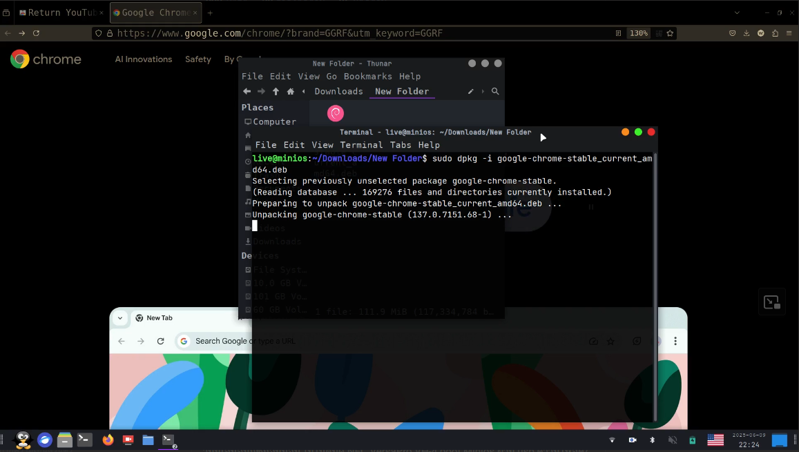

<link rel="stylesheet" href="https://cdn.simplecss.org/simple.min.css">
[[หน้าหลัก]](index.md)

# ธีมและไอคอนที่ชอบ

1. ไอคอน  [Papirus Icon](https://github.com/PapirusDevelopmentTeam/papirus-icon-theme/blob/master/install.sh)
1. ไอคอน [Uniform](https://www.gnome-look.org/p/1012468)
1. ตัวชี้ [Afterglow-Cursors](https://github.com/yeyushengfan258/Afterglow-Cursors)
1. ธีม [Default-optimized](https://github.com/Edsploration/default-optimized)
1. ฟอนต์ [Font JetBrains](https://www.jetbrains.com/lp/mono/)

### ไอคอน
   ติดตั้งที่ `~/urs/share/icons` หรือ `~/.icons`
### ธีม
   ติดตั้งที่ `~/urs/share/themes` หรือ `~/.themes`