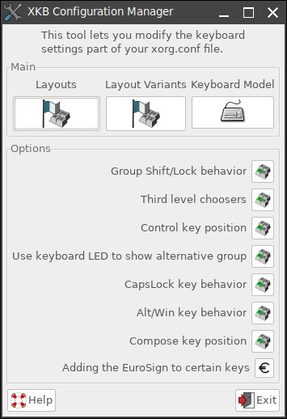

<link rel="stylesheet" href="https://cdn.simplecss.org/simple.min.css">

# การติดตั้งระบบปฏิบัติการ **[Puppy Linux](http://puppylinux.com/)**

   **ฟอนต์ภาษาไทย**
   ติดตั้งที่ `~/urs/share/fonts/`

   **แป้นพิมพ์ภาษาไทย**
1. ค้นหา Mouse/Keyboard Wizard ที่ Findnrun

2. เลือก Advanced Configuration

3. ปรากฏ XKB Configyration Manger ในกรอบ Main เลือก Layouts

4. เลือก และเลือกภาษาไทย

  **การสลับภาษา**
1. ไปที่ XKB Confuguration Manger ในช่อง Option เลือก Group Shift/Lock behavior

2. ปรากฏ Configuration Group Xkb Opion, เลือก grp:ctrl_shift_toglle Ctrl+Shift และ OK

ตอนนี้เราสามารถสลับภาษาได้ได้การกด Ctrl+Shift พร้อมกัน

ข้อสังเกต: กระผมยังไม่พบวิธีแสดงสัญลักษณ์แสดงภาษาปัจจุบันของแป้นพิมพ์ เช่น อักษรย่อ, ธงชาติ